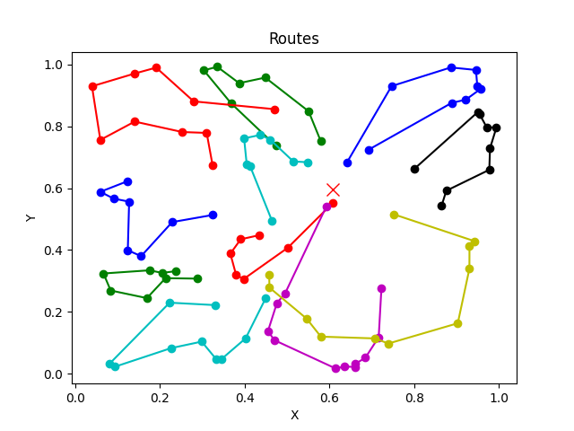

# Welcome to RouteML

## Installation

To get started with RouteML, follow these installation instructions:

1. Ensure you have Python and pip installed on your system.
2. Open a terminal or command prompt.
3. Run the following command to install RouteML:

```shell
pip install routeml
```

## Usage

Once you have installed RouteML, you can explore the functionality and usage by referring to the unit and integration tests located in the `tests` folder. These tests provide examples and demonstrate various features of the library.

Additionally, you may find it helpful to visualize the Vehicle Routing Problem (VRP) routes. You can refer to the image below for an example:



This image showcases a solution for the VRP route.

<!-- ## Commands -->

<!-- * `mkdocs new [dir-name]` - Create a new project.
* `mkdocs serve` - Start the live-reloading docs server.
* `mkdocs build` - Build the documentation site.
* `mkdocs -h` - Print help message and exit. -->

<!-- ## Project layout -->

<!-- mkdocs.yml    # The configuration file.
docs/
    index.md  # The documentation homepage.
    ...       # Other markdown pages, images, and other files. -->
